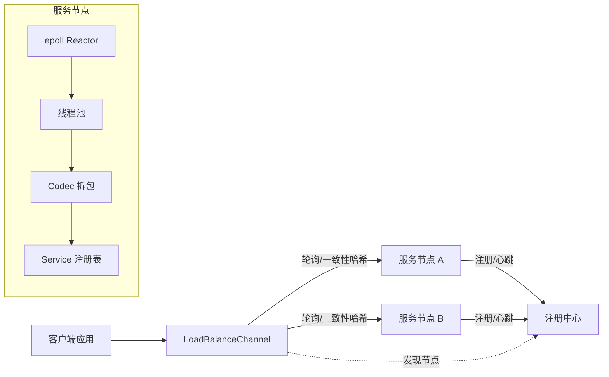
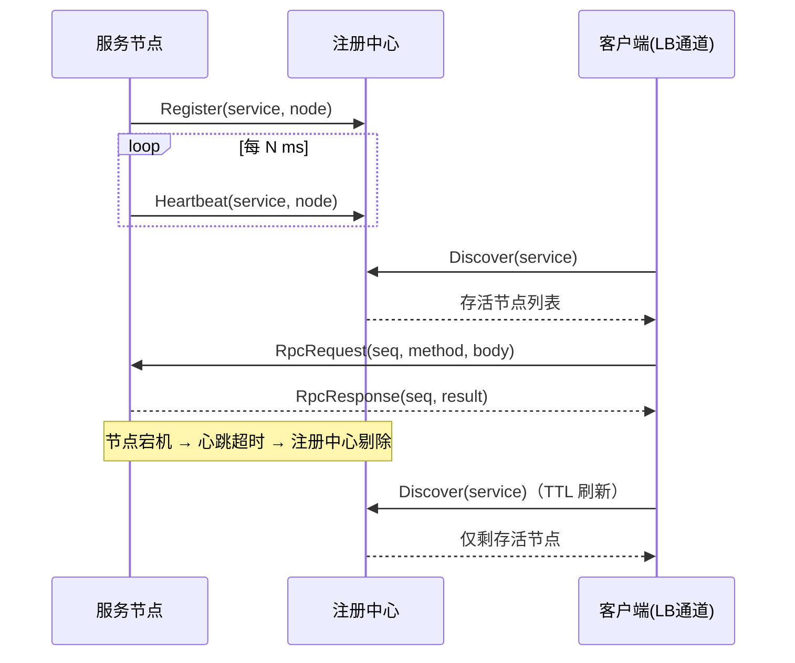

# MiniRPC

面向校招简历的轻量级 C++17 RPC 框架（开发中）。

基于 Linux epoll Reactor 模型、线程池与 Protobuf 序列化，从零实现服务注册/发现、负载均衡、超时重试与压测报告。详见 [计划书.md](计划书.md)。

## 功能特性

- **网络层**：epoll Reactor（LT）+ eventfd 唤醒 + Buffer（粘包/半包处理），单 Reactor 主线程 + 线程池处理业务。
- **协议**：24 字节自定义协议头（魔数/版本/类型/序列号/长度）+ Protobuf 内部信封（RpcRequest/RpcResponse），Codec 与业务解耦。
- **RPC**：Service 注册表（protobuf 反射分发）、RpcServer、同步 RpcChannel（seq 匹配 + 超时重试）、RpcController（错误码/错误文本）。
- **注册中心**：Register/Discover/Heartbeat/Unregister，心跳超时剔除（注册中心本身是一个 RPC 服务）。
- **负载均衡**：轮询 + 一致性哈希（虚拟节点），节点列表 TTL 刷新，连接级失败自动换节点重试。
- **工程化**：CMake + protoc 自动生成、6 个测试目标、压测程序与报告、决策记录与面试 Q&A。

## 开发环境（WSL2 内直开）

| 组件 | 版本 |
|---|---|
| 系统 | Ubuntu 24.04.4 LTS（WSL2，内核 6.6.87.2-microsoft-standard-WSL2） |
| 编译器 | g++ 13.3.0 |
| CMake | 3.28.3 |
| git | 2.43.0 |
| protobuf | protoc 3.21.12 + libprotobuf-dev（已安装，CMake 默认开启） |
| valgrind | 3.22.0（已安装） |

安装依赖：

```bash
sudo apt update
sudo apt install -y protobuf-compiler libprotobuf-dev valgrind
```

## 构建

```bash
cmake -B build
cmake --build build -j
```

protobuf 默认开启（依赖 `protobuf-compiler` / `libprotobuf-dev`）。压测请用 Release 构建：

```bash
cmake -B build-rel -DCMAKE_BUILD_TYPE=Release
cmake --build build-rel -j
```

## 运行 echo 示例

终端 1（服务端）：

```bash
./build/examples/echo_server 8888
```

终端 2（客户端，逐行回显）：

```bash
printf 'hello minirpc\nworld\n' | ./build/examples/echo_client 127.0.0.1 8888
```

也可以直接用 nc 验证：

```bash
nc 127.0.0.1 8888
```

并发压力验证（N 个客户端 × M 条消息，校验回显一致）：

```bash
./build/examples/echo_stress 127.0.0.1 8888 16 50
```

echo 服务端已接入线程池：主 reactor 负责 IO 与分发，消息处理在工作线程执行。

## RPC 示例与调用流程

终端 1（服务端，注册 EchoService 与 CalculatorService）：

```bash
./build/examples/calculator_server 8888
```

终端 2（客户端，同步调用）：

```bash
./build/examples/calculator_client 127.0.0.1 8888
```

一次完整 RPC 调用：

1. 客户端创建 `RpcChannel`（配置超时与重试次数），生成对应 `Service::Stub` 发起调用。
2. `RpcChannel::CallMethod` 组装内部信封 `RpcRequest`（method 全名 + 序列化请求），加上 24 字节协议头（type=request、唯一 seq）经 Codec 编码后发送；阻塞等待响应，超时自动重试（新 seq）。
3. 服务端 epoll 收到数据 → Codec 按长度字段拆包 → 提交线程池。
4. 工作线程解析 `RpcRequest` → 按 `service.method` 查注册表 → 反序列化请求 → 调用 Service 方法（传入 `RpcController`）。
5. 执行结果打包为 `RpcResponse` 信封 + 协议头（type=response、相同 seq）回发。
6. 客户端按 seq 匹配响应并反序列化填充；错误经 `RpcController`（错误码 + 错误文本）返回。

## 架构





## 注册中心与负载均衡示例

终端 1（注册中心）：

```bash
./build/registry/registry_server 18800
```

终端 2 / 3（两个服务节点，自动注册 + 心跳，心跳间隔 500ms）：

```bash
./build/examples/rpc_node 9001 node-a 18800 500
./build/examples/rpc_node 9002 node-b 18800 500
```

终端 4（负载均衡客户端）：

```bash
./build/examples/lb_client 18800 20 rr   # 轮询
./build/examples/lb_client 18800 20 ch   # 一致性哈希
```

故障剔除演示：杀掉 node-b 进程，等待心跳超时（默认 6s），lb_client 刷新后只剩 node-a，调用全部成功。

## 压测

```bash
./build-rel/examples/calculator_server 8888 standalone 4
./build-rel/benchmark/benchmark 127.0.0.1 8888 40 500
```

实测（Release，WSL2 本机）：40 并发约 3.16 万 QPS，P99 2.6ms；服务端 CPU 约 1.3 核、内存约 6.6MB。完整数据与方法见 [benchmark/report.md](benchmark/report.md)。

## 测试

```bash
ctest --test-dir build --output-on-failure
```

覆盖：Buffer 读写与拆包、ThreadPool 提交/并发/异常传播/优先级/回调、Codec 编解码回环（逐字节半包、任意切分、粘包、非法报文）、RPC 集成（正常调用、业务错误、超时重试、连接拒绝）、负载均衡单测、双节点注册/发现/心跳剔除。

> 注：`rpc_test` / `registry_test` 需要创建 TCP socket，在受限沙箱中需放行网络或单独运行 `./build/tests/rpc_test`、`./build/tests/registry_test`。

## 目录结构

```text
minRPC/
├── include/minirpc/
│   ├── common/    # 日志、错误码、工具
│   ├── net/       # EventLoop、EpollPoller、TcpServer、Buffer
│   ├── thread/    # ThreadPool（任务队列 + 条件变量，复用自 cpp_learn）
│   ├── codec/     # 协议头（24 字节）+ Protobuf 编解码
│   ├── rpc/       # RpcServer、RpcChannel、RpcController、ServiceRegistry、负载均衡
│   └── registry/  # RegistryServiceImpl（注册中心服务）
├── src/
├── proto/         # echo / calculator / rpc 信封 / registry proto（protoc 生成代码）
├── registry/      # 注册中心可执行程序（RegistryServiceImpl + registry_server）
├── examples/echo/ # echo 示例
├── examples/rpc/  # calculator、rpc_node、lb_client 示例
├── benchmark/     # 压测程序与报告
├── docs/          # 决策记录、面试 Q&A
└── tests/         # 单元与集成测试
```

## 文档

- [计划书.md](计划书.md)：项目定位、里程碑与验收标准（4 周计划已完成）
- [docs/decisions.md](docs/decisions.md)：关键设计决策记录（D1-D7）
- [docs/interview-qa.md](docs/interview-qa.md)：面试 Q&A（按模块）
- [docs/interview-qa-deep.md](docs/interview-qa-deep.md)：面试追问 QA（按场景，含追问链）
- [benchmark/report.md](benchmark/report.md)：压测方法、数据与结论
- [docs/tutorial/00-索引与学习路径.md](docs/tutorial/00-索引与学习路径.md)：RPC 学习教程（6 章，约 18 小时）
- [docs/class-reference.md](docs/class-reference.md)：类详解与类关系
- [docs/resume-summary.md](docs/resume-summary.md)：简历项目描述
- [docs/project-intro.md](docs/project-intro.md)：项目介绍稿（30 秒/2 分钟/5 分钟）

## 当前进度

- [x] WSL2 环境验证
- [x] CMake 工程 + 目录骨架
- [x] 日志模块
- [x] EventLoop + EpollPoller
- [x] Buffer（读写缓冲、粘包半包处理）
- [x] TcpServer / TcpConnection 连接管理
- [x] echo 示例（nc / 自写客户端均可回显）
- [x] 安装 protobuf / valgrind（用户 sudo 安装，CMake 接入验证通过）
- [x] ThreadPool（复用 cpp_learn 线程池，接入统一日志）
- [x] 协议头（魔数/版本/类型/序列号/长度）+ Codec 编解码
- [x] protoc 接入 CMake（Echo/Calculator proto）
- [x] codec_test / threadpool_test（粘包半包边界、并发与优先级）
- [x] echo 并发验证（16 客户端 × 50 消息 = 800 请求，0 失败）
- [x] ServiceRegistry / RpcServer / RpcChannel / RpcController
- [x] 内部信封 proto（RpcRequest/RpcResponse）+ 完整调用链路
- [x] 超时重试（黑洞服务端验证：2 次尝试后 kTimeout）
- [x] rpc_test 集成测试 + calculator 示例演示通过
- [x] 注册中心（注册/发现/心跳剔除，RegistryServiceImpl）
- [x] 轮询 + 一致性哈希负载均衡（loadbalancer_test 通过）
- [x] RpcServiceNode 自动注册 + LoadBalanceChannel 故障转移
- [x] 双节点故障剔除验收（registry_test 通过）+ 完整演示
- [x] 压测程序与报告（40 并发 3.16 万 QPS，P99 2.6ms）
- [x] docs/interview-qa.md 面试 Q&A
- [ ] 异步客户端（可选加分项，留待后续）

四周边计划（网络层 → 线程池/协议 → RPC 核心 → 注册中心/负载均衡/压测）已于 2026-08-02 全部完成。
