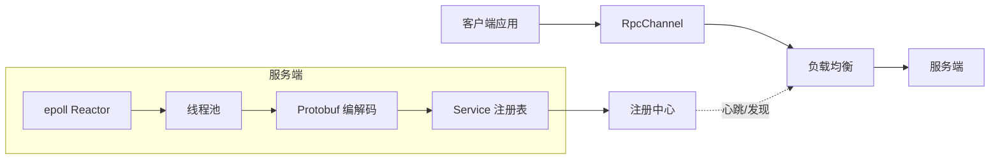

# MiniRPC 项目计划书

> 一个面向校招简历的轻量级 C++17 RPC 框架
> 版本：v0.4 ｜ 日期：2026-08-02 ｜ 状态：进行中
>
> v0.4 变更：开发环境由「Windows 侧开发」切换为「WSL2 内直开」，Codex agent 与开发工具链运行在同一个 WSL2 发行版内。

## 1. 项目定位

**一句话**：基于 Linux epoll Reactor 模型、线程池与 Protobuf 序列化，从零实现一个轻量级 RPC 框架（约 3000-5000 行），具备服务注册/发现、负载均衡、超时重试与压测报告。

**目标**：

- 校招 C++/后端方向简历项目，具备可讲的深度
- 规模可控，任何模块都能在半小时内讲清楚
- 可以完整演示：客户端一次 RPC 调用的全链路

**非目标（防止范围膨胀）**：

- 不做分布式事务、一致性协议（Raft/Paxos）
- 不做全功能注册中心（Zookeeper/etcd）
- 不做跨语言（先 C++ 客户端/服务端）

## 2. 技术栈

| 类别 | 选型 | 说明 |
|---|---|---|
| 语言 | C++17 | 现代特性：智能指针、std::thread、std::atomic、lambda |
| 构建 | CMake >= 3.16 | 支持 FetchContent 拉取 protobuf |
| 平台 | WSL2 Ubuntu 24.04.4（开发/构建/测试/Agent 均在 WSL2 内直接执行） | 详见 2.1 节实测环境 |
| 网络 | POSIX socket + epoll | 非阻塞 IO，Reactor 模型 |
| 并发 | std::thread + 锁/条件变量 | 线程池、原子计数 |
| 序列化 | Protocol Buffers | protoc 生成代码 |
| 测试 | 自研断言 + 压测程序 | 不引入重量级测试框架（可选 gtest） |
| 工具 | git / valgrind / gdb / perf / top | 调试与性能分析 |

## 2.1 开发环境：WSL2 Ubuntu-24.04（实测信息）

> 开发模式已切换为「直接在 WSL2 内开发」：Windows 侧仅负责运行 WSL2，代码编写、构建、测试、git、压测以及 Codex agent 全部运行在同一个 WSL2 发行版内，工具链与实际执行环境一致，不再依赖 Windows 侧路径或工具。

实测信息（2026-08-02 在 WSL2 内直接采集）：

| 项目 | 实测值 | 说明 |
|---|---|---|
| 发行版 | Ubuntu 24.04.4 LTS（Noble） | `/etc/os-release` |
| 内核 | 6.6.87.2-microsoft-standard-WSL2 | WSL2 官方内核，x86_64 |
| 用户 / 主目录 | `nina` / `/home/nina` | 普通用户；apt 安装需 `sudo` |
| CPU | 16 核（`nproc`） | 压测并发梯度最高可到 16+ |
| 内存 | 15 GiB 总量，当前可用约 13 GiB | 压测注意连接数/文件描述符上限 |
| g++ | 13.3.0（Ubuntu 13.3.0-6ubuntu2~24.04.1） | 完整支持 C++17/20 |
| CMake | 3.28.3 | 支持 `FetchContent` |
| git | 2.43.0 | 仓库已初始化（`main`，暂无提交） |
| protobuf | 已安装：protoc 3.21.12 / libprotobuf-dev 3.21.12 | Ubuntu 24.04 软件源默认版本 |
| valgrind | 已安装：3.22.0 | 压测与内存检查可用 |
| WSLg / 挂载盘 | 可用（`/mnt/c`、`/mnt/wslg` 存在） | 日常开发不依赖，仅按需访问 |

**当前环境待办**：

- [x] 安装 protobuf：protoc 3.21.12 / libprotobuf-dev 3.21.12
- [x] （可选）安装 valgrind：3.22.0
- [x] 首次提交（2026-08-02 完成，约定式 commit）

> 注：protobuf/valgrind 由用户在终端以 sudo 安装完成（2026-08-02），`MINIRPC_ENABLE_PROTOBUF=ON` 的 CMake 接入已验证构建通过。

**可复用模块（先记录位置，执行时再具体查看）**：

- 线程池：`/home/nina/cpp_learn/threadpool`（此前已完成的项目；第 2 周实现线程模块时直接查看并评估复用/改造，当前阶段不细读）

## 2.2 开发协作方式：WSL2 直开 + Codex Agent 同环境

- 唯一开发环境是 WSL2（Ubuntu 24.04.4），Windows 侧不再承担代码编辑/构建/运行职责；Windows 侧如需查看文件，只读访问 `\\wsl.localhost\Ubuntu-24.04\home\nina\minRPC` 即可，不做任何读写操作。
- Codex agent 运行在同一个 WSL2 环境内，`cmake`、`g++`、`git`、压测程序都在本机直接执行，命令路径就是真实执行路径，无需路径翻译。
- 所有项目文件只存放在 WSL 内 `/home/nina/` 下（含 `/home/nina/minRPC` 与 `/home/nina/cpp_learn`），禁止放到 `/mnt/c` 共享盘，避免跨文件系统带来的权限、行尾符与性能问题。
- 压测结果一律标注本固定环境（16 核 / 15 GiB / 内核 6.6.87.2 / Ubuntu 24.04.4），保证报告可复现。

## 3. 总体验收标准

功能验收：

- [ ] Echo/Calculator 示例可运行：客户端调用远程方法得到正确结果
- [ ] 支持多客户端并发连接
- [ ] 支持服务注册、发现、心跳剔除
- [ ] 支持轮询与一致性哈希负载均衡
- [ ] 支持超时重试

性能目标（本机 WSL2 实测为准）：

- [ ] 单机 echo RPC QPS >= 3 万
- [ ] P99 延迟 <= 5 ms
- [ ] 压测报告含 CPU、内存、连接数变化

## 4. 目录结构

```
minRPC/
├── CMakeLists.txt
├── README.md
├── 计划书.md
├── include/minirpc/
│   ├── common/        # 日志、错误码、工具
│   ├── net/           # EventLoop、Poller、TcpServer、Buffer
│   ├── thread/        # ThreadPool
│   ├── codec/         # 协议头、Protobuf 编解码
│   └── rpc/           # RpcServer、RpcChannel、Service
├── src/
│   └── ...            # 与 include 对应
├── proto/             # .proto 定义
├── registry/          # 简版注册中心（独立可执行程序）
├── examples/          # echo / calculator / 并发示例
├── benchmark/         # 压测程序与报告
└── tests/             # 单元与集成测试
```

> 项目根目录放在 WSL 内：`/home/nina/minRPC`（Windows 侧路径 `\\wsl.localhost\Ubuntu-24.04\home\nina\minRPC`）。
>
> 所有开发、构建、测试、git 与压测均在 WSL2 内直接完成；Windows 侧路径仅作只读查看参考，日常不依赖。

## 5. 架构设计



调用链路（客户端视角）：

1. 从注册中心拉取服务节点列表
2. 负载均衡选一个节点
3. RpcChannel 组装请求：协议头 + 序列化后的 request
4. 服务端 epoll 收到数据 -> 解码 -> 线程池调度 -> Service 方法执行 -> 回包
5. 客户端收到 response，超时则重试

## 6. 模块拆分与工作量

| 模块 | 核心内容 | 预估行数 | 验收标准 |
|---|---|---|---|
| common | 日志、错误码、工具函数 | 300-500 | 日志分级输出、线程安全 |
| net | EventLoop、EpollPoller、TcpConnection、Buffer | 800-1200 | echo server 跑通、并发连接 |
| thread | 线程池、任务封装 | 0-300（优先复用 `/home/nina/cpp_learn/threadpool`） | 任务并发执行正确 |
| codec | 协议头、粘包半包、Protobuf | 300-500 | 单测覆盖拆包边界 |
| rpc | RpcServer/RpcChannel/RpcController | 600-900 | Calculator 全链路跑通 |
| registry | 注册、发现、心跳 | 300-500 | 服务宕机后被剔除 |
| loadbalance | 轮询、一致性哈希 | 200-300 | 多节点分发正确 |
| benchmark | 压测客户端、指标统计 | 300-400 | 输出 QPS/P99 报告 |

合计约 3000-4500 行，符合"深度够、规模小"的定位。

## 7. 里程碑计划（4 周）

### 第 1 周：环境与网络层

目标：搭好工程骨架，epoll echo server 可运行。

- [x] WSL2 环境验证（Ubuntu 24.04.4：g++ 13.3 / cmake 3.28.3 / git 2.43，内核 6.6.87.2-microsoft-standard-WSL2，16 核 / 15 GiB）
- [x] 安装 protobuf（protoc 3.21.12 + libprotobuf-dev，CMake 接入验证通过）
- [x] CMake 工程 + 目录骨架
- [x] 日志模块（线程安全、分级输出）
- [x] EventLoop + EpollPoller
- [x] Buffer（读写缓冲、粘包半包处理，含单测）
- [x] TcpServer / TcpConnection 连接管理
- [x] 首次 git 提交（约定式：`docs:` / `feat:`）
- 验收：examples/echo 通过 `nc` 与自写客户端回显成功（2026-08-02 实测）；README 已记录环境搭建命令

### 第 2 周：并发模型与协议

目标：线程池 + Protobuf 编解码，自定协议头。

- [ ] 查看 `/home/nina/cpp_learn/threadpool` 现有实现，决定复用或改造
- [ ] 线程池（任务队列 + 条件变量）
- [ ] 协议头定义（魔数/版本/类型/序列号/长度）
- [ ] protoc 接入 CMake，定义 Echo/Calculator proto
- [ ] Codec 编解码与半包测试
- 验收：tests/codec_test 覆盖拆包边界；压测前的 echo 服务可支撑并发

### 第 3 周：RPC 核心

目标：一次完整 RPC 调用。

- [ ] Service 抽象与注册表
- [ ] RpcServer 接收请求并分发
- [ ] RpcChannel 客户端封装（同步调用）
- [ ] RpcController：错误码、超时
- [ ] 超时重试（保证请求幂等或可重放）
- 验收：examples/calculator 从客户端调用成功；README 说明调用流程

### 第 4 周：注册中心、负载均衡与压测

目标：完整分布式形态 + 数据说话。

- [ ] 注册中心：服务注册/拉取/心跳剔除
- [ ] 轮询 + 一致性哈希负载均衡
- [ ] 异步客户端（可选加分项）
- [ ] 压测程序：QPS、P99、CPU/内存
- [ ] 架构图、README、压测报告、面试 Q&A
- 验收：双服务节点 + 注册中心演示故障剔除；压测报告产出

## 8. 关键设计决策（含面试话术）

| 问题 | 我们的选择 | 面试要点 |
|---|---|---|
| 为什么不用 asio/boost | 自研更能体现网络编程功底 | 能说清 epoll 事件循环细节 |
| 每连接一线程 vs Reactor | Reactor | 线程开销、fd 数量、上下文切换 |
| ET 还是 LT | LT 起步（简单可靠），可选 ET | 触发语义、read 直到 EAGAIN、饥饿问题 |
| 线程模型 | 主 reactor 监听 + 线程池处理 | 锁粒度、任务队列、如何避免惊群 |
| 粘包/半包 | 协议头长度字段 + Buffer 解析 | TLV、序列号、字节序 |
| 超时重试 | 超时判定 + 有限重试 | 幂等性、请求序列号去重 |
| 一致性哈希 | 虚拟节点 + 有序 map | 平滑扩容、数据倾斜 |
| 性能瓶颈 | 先压测再优化 | CPU/锁/系统调用分析路径 |

## 9. 测试与压测计划

单元测试：

- Buffer 拆包边界、协议头编解码
- 线程池任务执行
- 负载均衡分发均匀性

集成测试：

- 1 个注册中心 + 2 个服务节点 + 多客户端并发
- 杀掉一个服务节点，验证剔除与故障转移
- 连续调用 10 万次，验证无内存泄漏（valgrind 抽查）

压测方法：

- 固定环境：WSL2 本机，记录 CPU 核数、内存
- 客户端并发数梯度：1 / 10 / 50 / 100 / 200
- 输出：QPS、平均延迟、P99、错误率、CPU/内存

## 10. 风险与对策

| 风险 | 影响 | 对策 |
|---|---|---|
| 范围膨胀 | 项目烂尾 | 严格执行"非目标"，砍功能优先 |
| 网络编程报错难排查 | 卡进度 | 先写最小 echo 再叠加；gdb/日志 |
| Protobuf 接入 CMake 麻烦 | 浪费一天 | 提前验证 FetchContent 或系统包 |
| 时间不够（秋招紧迫） | 简历来不及 | MVP 控制在 2 周，注册中心可后置 |
| WSL2 性能与裸机有差异 | 压测绝对值被面试官质疑 | 报告固定标注 WSL2 环境（16 核 / 15GiB / 内核 6.6.87.2）；主打相对优化与分析方法，必要时用物理 Linux 复测 |
| 项目文件被放到 `/mnt/c` 跨系统读写 | 权限/行尾符/性能问题 | 所有文件只放 WSL 内 `/home/nina/`，Windows 侧只读查看 |

## 11. 交付物清单

- [ ] 完整源码（可构建：`cmake -B build && cmake --build build`）
- [ ] README.md：架构、构建、使用、调用流程图
- [ ] 压测报告：benchmark/report.md（含表格与结论）
- [ ] 面试 Q&A：docs/interview-qa.md（每个模块 3-5 个问题）
- [ ] 演示脚本：一键启动注册中心、双服务节点、客户端调用

## 12. 简历条目示例

> 基于 epoll 的轻量级 C++17 RPC 框架（约 4000 行）
> - 实现 Reactor 多线程模型：主线程监听、线程池处理读写与业务，压测 QPS X 万、P99 Y ms
> - 自研协议头 + Protobuf 序列化，解决粘包、半包与字节序问题
> - 实现服务注册/发现、心跳剔除、轮询与一致性哈希负载均衡、超时重试
> - 输出完整压测报告与面试级架构文档

## 13. 开发协作约定（供 Codex 执行）

1. 每次开发先看本计划书对应章节，明确本阶段验收标准
2. 每完成一个模块：编译通过 -> 跑对应测试 -> 更新 README/文档
3. Git 提交粒度：一个功能点一个 commit，message 用约定式（feat/fix/test/docs）
4. 遇到不确定的设计，先记录到 docs/decisions.md 再实现
5. 每周对照里程碑打勾，偏离时优先收缩范围
6. 所有命令在 WSL2 内直接执行（Agent 与用户同环境）；项目文件禁止放在 `/mnt/c`，Windows 侧仅只读查看

---

*本计划书由 Codex 与用户共同维护，随项目进展更新。*
